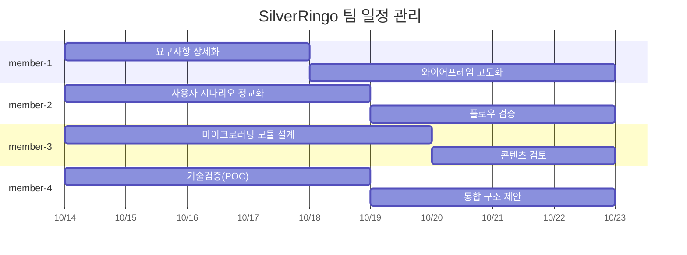

# Team Schedule (Gantt)

아래 간트 차트는 팀원 단위의 일정 관리를 위한 기본 템플릿입니다.

```mermaid
gantt
    title SilverRingo 팀 일정 관리
    dateFormat  YYYY-MM-DD
    axisFormat  %m/%d

    section member-1
    요구사항 상세화           :m1a, 2026-10-14, 4d
    와이어프레임 고도화       :m1b, after m1a, 5d

    section member-2
    사용자 시나리오 정교화    :m2a, 2026-10-14, 5d
    플로우 검증               :m2b, after m2a, 4d

    section member-3
    마이크로러닝 모듈 설계    :m3a, 2026-10-14, 6d
    콘텐츠 검토               :m3b, after m3a, 3d

    section member-4
    기술검증(POC)             :m4a, 2026-10-14, 5d
    통합 구조 제안            :m4b, after m4a, 4d
```

## 사용 가이드
- 일정 변경 시 시작일/기간만 수정해도 전체 의존 관계를 빠르게 업데이트할 수 있습니다.
- `docs/progress/PROJECT_PROGRESS.md`의 "현재 작업/다음 액션"과 함께 주기적으로 동기화합니다.
